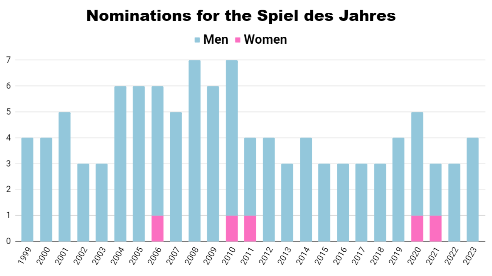

# Historical Games Studies - 2024\*

## HIST 5906 - Historical Games Studies

### Overview

We once thought games were childish things to put aside when we got older. This maxim holds true neither in our society, where adults have embraced analog and digital games, nor in academia, where games have become the subject of serious study. And we all play games. Or at least we did at some point. This class asks you to play games so that you can _think_ about them, as historians and as cultural analysts.&#x20;

School teaches students how to read and interpret all sorts of media - whether how to read and interpret poetry, how to make sense and talk about film, or how to interpret music. All these different forms of media are treated as objects of inquiry that deserve special tools for understanding them. This course offers the same for games (both analog and digital games) from the perspective of a historian. It teaches students how to speak about games (i.e. key terminology), what analytical frameworks to use, and why we should bother. It will also encourage students to test their hand at game design. Exercises will get students to test their hand at simple game design projects, which may offer them insight into the process or lead to a larger game design project for students to pursue as a final project.&#x20;

My goal is for students to see games both from the perspective of consumers and of creators. I want you to analyze critically how games reflect the world from which they emerge, and how people learn from games. But I also want you to be able to historicize this knowledge and to recognize how games are made, played, disseminated, and how these processes have a huge impact on how the world or past worlds– are represented. By turning games into objects of our critical gaze, students will learn to unpack some of most widely consumed representations of the past in today’s culture.&#x20;

We will be reading academic articles and books, as well as blogs or online videos, to learn how historians think about games and history. The works of [C.T. Nguyen](https://ocul-crl.primo.exlibrisgroup.com/permalink/01OCUL\_CRL/hgdufh/alma991022774628305153), [Adam Chapman](https://ocul-crl.primo.exlibrisgroup.com/permalink/01OCUL\_CRL/1lrs5km/alma991005629549705153) and [Jeremiah McCall](https://ocul-crl.primo.exlibrisgroup.com/permalink/01OCUL\_CRL/1lrs5km/alma991022631320405153) will be key sources for discussion. We will work from fundamentals – asking what a game is and whether games can be _history_, before exploring methodologies to inform our analysis and game design.

This course asks you to experiment and open yourself to new ways of questioning how the past is represented. A willingness to participate actively goes a long way in helping you succeed in this course!

### Coursework

This course is intended to give students latitude to pursue a wide variety of options for coursework. In addition to set readings, related in-class discussion, and complementary exercises, students will be expected to complete a larger project of their choosing related to the field of historical game studies. Individually or as part of a larger collaborative effort, students may complete a project of their own design, which may look like:

* _an analysis of analog or digital games_ using one of the methodologies discussed in class. This might be a survey of a genre of games (tabletop games about nineteenth-century railroads, or card games involving neo-medieval/fantasy worlds). Your project could be narrow (e.g. how does _Magic: the Gathering_ represent book and manuscript culture?) or broad (e.g. what mechanics do WWI wargames use to depict the past and how do they compare with current historiography?). You might focus on contemporary games about the past as a form of historiography or look at past games as a form of historical evidence (e.g. what do dice games in Ancient Rome tell us about their society). You might have history and historiography at the centre of your work or perhaps a deconstruction of popular game mechanics.&#x20;
* _pedagogical preparation_. This might be an annotated course syllabus for how you would teach a university-level history course (or a particular historical subfield) with games, along with assignment descriptions and explanations for why you designed the course as you did. Or it could be compile research on the pedagogical use of games in order to justify using games in a grade 9 classroom.&#x20;
* _a game design product_. Perhaps you are interested in creating a history game of your own. If you propose a complex game, you could provide an overview, justification and explanation of your potential game design (e.g. a game design document). For simpler games, you could create a prototype (cards, boardgame etc.) to be beta-tested by the class.&#x20;

Our goal will be to convert our reading and research into tangible products. And the class will be inherently collaborative. We want to run the seminar as a workshop to hear about and develop your ideas over the course of your term. We will work together to brainstorm ideas, deepen your analysis and propose avenues of research, plan out scenarios, or critique your game designs.&#x20;

In class, we will use [Obsidian](https://obsidian.md/) to write and share research notes – as a way to teach students how to make [smart notes](https://www.soenkeahrens.de/en/takesmartnotes), keep track of knowledge digitally and effectively design a research project.&#x20;

### Is this class for you?

You do not need to have any experience with games or gaming culture. Arguably games and play are a universal human endeavour and everyone has played games of some sort that you can draw on to understand the topic. I, your professor, am a medievalist, so my scholarly knowledge focuses on games relating to the Middle Ages. You are likely to be more knowledgeable than I am about the details of many games and game subcultures.&#x20;


Courses involving games, games studies and game design tend to skew male. The Games industry certainly does and there is a history of sexism and discrimination behind it. This class is expressly intended crack open this world for anyone who is interested and to show that anyone can belong in this world – this is not a class only for the already initiated.


<figure><figcaption>
As this chart suggest, society needs more gender diversity in the game community. 
</figcaption></figure>

