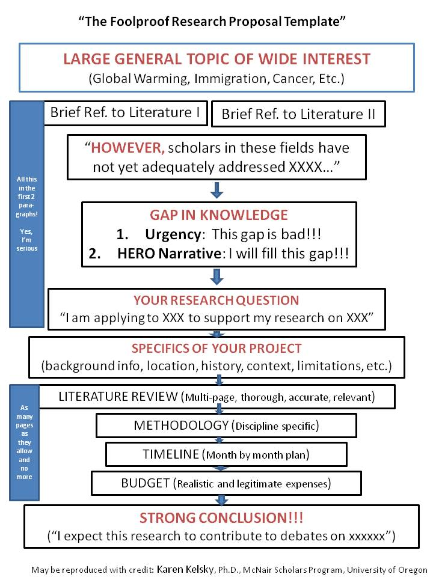

# 2A. Project Proposal\*

**Due**: March 7th, 2024 (by start of class)

**Weight**: 25% of final grade

**Medium**: Any (template in Obsidian)

**Stream**: Game Analysis

So, you want to analyze a game?

Your goal for this stage of your work is to create a formal research proposal (along the lines of a thesis proposal or a project description for OGS/ SSHRC) that explains and justifies a potential avenue of research/ game analysis. &#x20;


While your proposal will likely build on your reading and research in the annotated bibliography, it will need to contextualize and further specify that work. Your proposal should not reuse any text previously written for your annotated bibliography.&#x20;


### Contents

1. **Research Proposal** (\~2000 words). This concisely worded outline of future research needs to show your ability to see both the macro and the micro – to be aware of methodology and theoretical debates but also have identified a clear text (or game, in our case) that you want to work on.&#x20;
   1. Open your thesis proposal with a clear statement of thesis for your future research – you are not writing a detective novel expecting that the reader will tease out the clues in a mystery! Your first line should be a simple sentence that could be understood by someone in grade nine. Your introductory paragraph should be no more than a few sentences. Tell the reader why they should care about your work.&#x20;
   2. If you do not yet have a thesis, find one, fast. This is key to organizing this whole thing and it lets you get rid of extraneous details.&#x20;
   3. Explain generally what you are looking at: time period, topic. If you topic is medieval, you can assume I know a fair bit about it, so you can write accordingly. If you are dealing with a topic that is later than the 15th century, assume I know very little and write accordingly.
   4. Talk about how you have found a new trove of information to explore this topic. Reference specific archives/ texts/ games. **OR** talk about your relationship to secondary sources, and how you are going to innovate on past work by new theoretical/ methodological implications.
      1. For example, perhaps you want to talk about the game of _chaupur_, as a way to gain insight into the ruling mentality of&#x20;
   5. Close with an explicit statement of how your information will contribute to the field and how it makes the world a better place.
2. **Bibliography**. Your bibliography should list all primary and secondary sources you reference in the proposal, as well as works you suspect will be important for your future project (e.g. primary sources you have ordered on Inter-library loan but haven't received yet). Distinguish potentially useful sources (but unread) with an asterisk (\*) before the author name in the inner margin.&#x20;

### General Advice for writing research proposals in History

1. Plan on doing multiple drafts.
2. Mentioning specifics (document collections, foreign archives, scholarship) etc. conveys your preparation.
3. Citing theoretical or methodological texts (so long as they don’t seem forced) show your command of the field.
4. Using proper citation style shows your formal preparation...\
   e. Convey excitement. Find an aspect of your topic which allows you to say you are doing the neatest, newest most innovative thing ever. And be honest. You will likely be  read by subject specialists – historians are only read by historians. If you are being evaluated in other sections – religion, classics, art history, medieval studies – you should be aware that you may not be read by specialists in your field. All proposals will likely be read by people who do not have familiarity with your specific period/topic. \
   f. Therefore, It is generally a good idea to make sure that your proposal is absolutely readable by a non-historian. Ask your chemist friend to read it, and describe what he/she thinks you are doing. Modify accordingly.\
   g. Do not treat the proposal as an opportunity for autobiography – make it about research and your ideas, not how you got to your topic.\
   h. Keep your sentences simple.\
   i. Use active voice, always. Do not treat this proposal as if it is your grade 10 chemistry report.

Essentially, find a&#x20;

<figure><figcaption>
Credit:  Dr. Karen Kelsky of The Professor Is In, <a href="http://theprofessorisin.com/">http://theprofessorisin.com</a>
</figcaption></figure>
