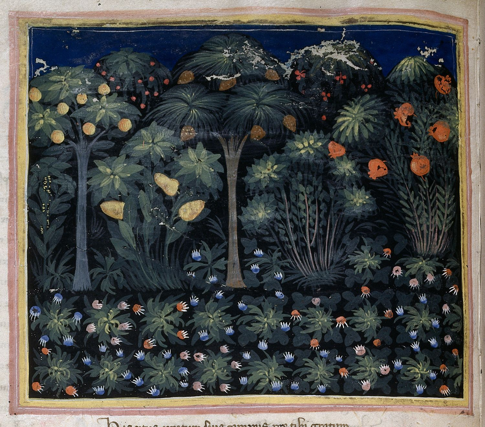

# What is a seminar?

The modern "seminar" is a form of small-group learning institutionalized in nineteenth-century German universities, intended to promote inquiry-led teaching. The idea was that this kind of learning would plant a seed of knowledge and allow intellectual life to germinate. The [Oxford English Dictionary ](https://www.oed.com/view/Entry/175679?isAdvanced=false\&result=2\&rskey=btvlCf&)provides a concise definition:&#x20;

> In German universities (hence in certain British, \[Canadian] and American universities), a select group of advanced students associated for special study and original research under the guidance of a professor. Also transferred, a class that meets for systematic study under the direction of a teacher.

In the German model (which was the model for British/ Canadian/ American/ French universities), the professor was an elite researcher, who worked on his research only with the best of his advanced students. I say "his", because in the ninteenth-century universities, professors were men (with a few rare, but noteable [exceptions](https://www.agnesscott.edu/lriddle/women/kova.htm)).&#x20;

<figure><figcaption>
London, British Library, MS Royal 6 E IX f. 15v
</figcaption></figure>

But this elite (elitest?) definition of seminar belies its medieval roots. In the Classical world, if you talked about a _seminarium_, you would be referring to a "nursery" for plants. In the Middle Ages, however, a _seminarium_ was a place where people began their studies, usually in the Church – the medieval metaphor being that young minds needed to be watered and cared for until they are established enough to thrive on their own. This is from where we get the modern English term, "seminary" (i.e. a place where priests learn).&#x20;

In this class, I want to think of the _seminar_ in this more medieval fashion (though I am definitely not training you to be priests...).  Today, the seminar is less research focussed than it was in the nineteenth century, but professors still imagine that small group as the best environment for letting students grow and thrive intellectually. Our nursery will hopefully water and nourish the seeds of creativity and interest in games students bring...
